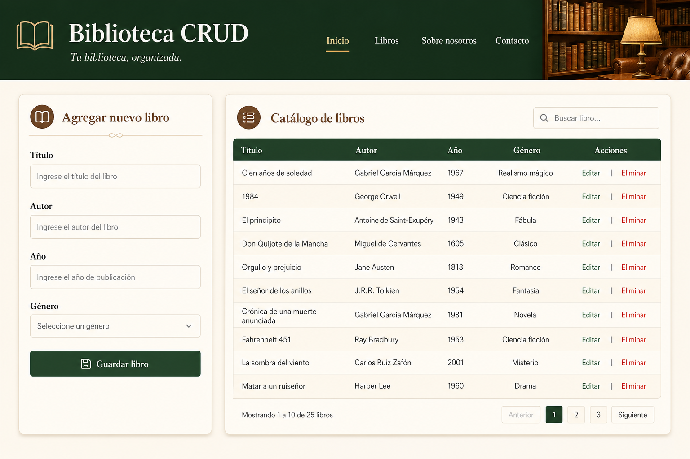

# Biblioteca CRUD

## Descripción

Aplicación web para administrar un catálogo de libros mediante operaciones CRUD completas. El backend expone una API REST sobre Django y MySQL, con validaciones duplicadas en servidor y cliente, protección frente a patrones peligrosos en texto (riesgos asociados a XML cuando dichos datos se procesan o serializan como marcado), creación idempotente coordinada con cerrojos de MySQL y endurecimiento HTTP básico habilitado desde Django.

## Tecnologías utilizadas

- Backend: Python 3, Django 4.2, Django REST Framework, PyMySQL, python-dotenv.
- Base de datos: MySQL 8 (utf8mb4, modo estricto recomendado).
- Frontend: React 18, Vite 5, CSS responsivo sin frameworks de componentes externos.
- Herramientas: npm para el frontend, migraciones de Django para el esquema relacional.

## Funcionalidades

- Registrar libros nuevos con los campos obligatorios título, autor, año y género.
- Listar todos los registros ordenados por fecha de actualización.
- Editar registros existentes mediante actualización parcial.
- Eliminar registros con confirmación explícita en la interfaz.
- Cabecera obligatoria `Idempotency-Key` en creaciones para ignorar reintentos duplicados que comparten la misma clave y devolver el mismo recurso sin repetir la inserción.
- Limitación de ritmo anónima configurable para absorber picos de tráfico legítimos sin tumbar el proceso de forma inmediata.

## Seguridad y escalabilidad

- Consultas a base de datos exclusivamente a través del ORM de Django para minimizar riesgo de inyección SQL.
- Validación de entrada en serializadores DRF y en el modelo (`full_clean`), más saneamiento de patrones XML peligrosos en texto libre.
- Restricciones en base de datos: clave única de idempotencia, integridad referencial en cascada entre idempotencia y libro, restricción de comprobación sobre el rango del año.
- Cerrojos nombrados `GET_LOCK` / `RELEASE_LOCK` de MySQL alrededor de la creación idempotente para coordinar hilos y procesos concurrentes contra la misma clave.
- Cabeceras recomendadas por Django (`SECURE_BROWSER_XSS_FILTER`, `X_FRAME_OPTIONS`, tipos MIME seguros) activas en configuración.
- Arquitectura stateless en la API salvo la persistencia compartida en MySQL, adecuada para escalar instancias de aplicación detrás de un balanceador siempre que todas compartan la misma base de datos y límites de conexión (`CONN_MAX_AGE` configurable).

## Heurísticas de Nielsen aplicadas en la interfaz

1. Visibilidad del estado del sistema mediante mensajes de estado y regiones `aria-live`.
2. Alineación con el mundo real mediante vocabulario de biblioteca en español.
3. Control y libertad del usuario con cancelación de edición y modal de confirmación de borrado.
4. Consistencia e idiomas visuales coherentes en botones, tablas y formularios.
5. Prevención de errores con validación antes de enviar y límites numéricos visibles.
6. Reconocimiento antes que recuerdo usando listas desplegables para géneros normalizados.
7. Flexibilidad para usuarios expertos mediante accesos por teclado y enlace de salto al contenido.
8. Diseño minimalista sin elementos decorativos innecesarios.
9. Ayuda a reconocer y recuperarse de errores con mensajes por campo y texto de ayuda corto.
10. Ayuda y documentación accesibles desde el README y una nota contextual en la página.

## Instrucciones para ejecutar el proyecto

### Prerrequisitos

- Python 3.9 o superior.
- Node.js 18 o superior y npm.
- Servidor MySQL en funcionamiento.

### Preparar la base de datos

Cree la base de datos y el usuario. Puede adaptar el script de ejemplo:

`scripts/mysql-init-ejemplo.sql`

### Configurar variables de entorno

Copie `backend/.env.example` a `backend/.env` y ajuste credenciales y orígenes CORS.

Opcional para el frontend en despliegues separados del backend: copie `frontend/.env.example` a `frontend/.env` y defina `VITE_API_URL` con la URL pública del backend (por ejemplo `https://api.midominio.com`). En desarrollo puede dejarla vacía para usar el proxy de Vite definido en `frontend/vite.config.js`.

### Backend

```bash
cd backend
python3 -m venv ../.venv
source ../.venv/bin/activate
pip install -r requirements.txt
python manage.py migrate
python manage.py runserver 0.0.0.0:8000
```

### Frontend

```bash
cd frontend
npm install
npm run dev
```

Abra `http://localhost:5173` en el navegador.

### Prueba rápida de idempotencia con curl

Primera petición crea el recurso. Una segunda petición idéntica debería devolver `200` y el mismo cuerpo si la clave se reutiliza.

```bash
export CLAVE="clave-demo-12345678"
curl -sS -X POST "http://127.0.0.1:8000/api/libros/" \
  -H "Content-Type: application/json" \
  -H "Idempotency-Key: $CLAVE" \
  -d '{"titulo":"Demo","autor":"Autor Demo","anio":2020,"genero":"ficcion"}'

curl -sS -X POST "http://127.0.0.1:8000/api/libros/" \
  -H "Content-Type: application/json" \
  -H "Idempotency-Key: $CLAVE" \
  -d '{"titulo":"Demo","autor":"Autor Demo","anio":2020,"genero":"ficcion"}'
```

## Evidencias visuales

Ilustración orientativa de la interfaz principal (mock visual generado como referencia de diseño cálido tipo librería):



Para evidencias reales de ejecución local, puede sustituir o complementar esta imagen con capturas PNG tomadas desde el navegador una vez levantados backend y frontend.

## Publicación en GitHub

```bash
git init
git add .
git commit -m "Initial commit: Biblioteca CRUD"
git branch -M main
git remote add origin https://github.com/USUARIO/biblioteca-crud.git
git push -u origin main
```

Reemplace `USUARIO` y el nombre del repositorio según corresponda.

## Uso de inteligencia artificial

Se utilizó asistencia de IA en Cursor para generar la estructura del repositorio, el código del backend y frontend, las validaciones de seguridad solicitadas, la documentación de este README y una imagen ilustrativa de interfaz. Las decisiones de arquitectura (Django REST Framework, React con Vite, MySQL, idempotencia con cerrojos y modelo relacional) fueron elegidas para cumplir explícitamente los requisitos del enunciado.
